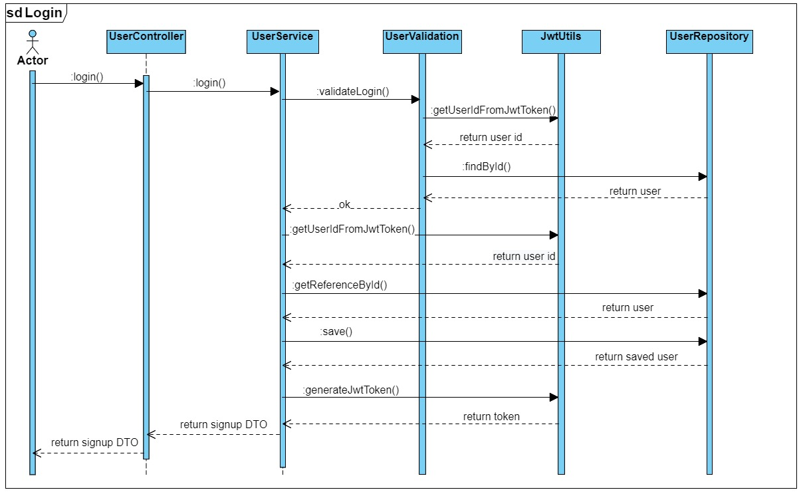
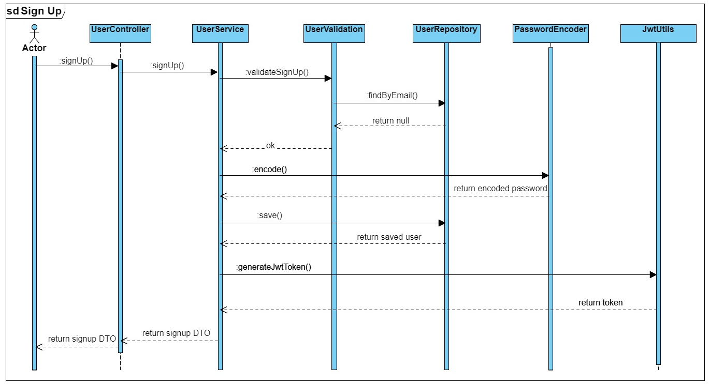

# Globallogic Challenge

Este repo contiene la evaluación Java solicitada por GlobalLogic para el rol de Desarrollador Senior. Es un microservicio hecho en Springboot y construido con Gradle.

### Levantar Local

Para compilar y levantar el proyecto localmente, ejecutar:

```
gradle clean build
java -jar "-Dspring.profiles.active=local" .\build\libs\challenge.jar
```

El proyecto levantará en el puerto 8080 con el path /challenge

### Variables de entorno

Listado de variables de entorno necesarias y su correspondiente valor por defecto en el profile 'local'

| Variable | Descripcion | Default |
| ------ | ------ | ------ |
| SPRING_DATASOURCE_URL | Url de conexión a la base | jdbc:h2:mem:testdb |
| SPRING_DATASOURCE_USERNAME | Usuario de conexión a la base | sa |
| SPRING_DATASOURCE_PASSWORD | Contraseña de conexión a la base | password |
| JWT_SECRET | Secret para armar el JWT | mySecretKey |
| JWT_EXPIRATIONMS | Periodo de expiración del JWT en Milisegundos | 86400000 |

### Diagramas de secuencia



